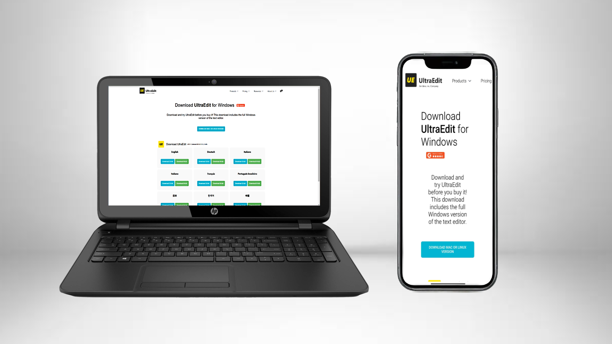
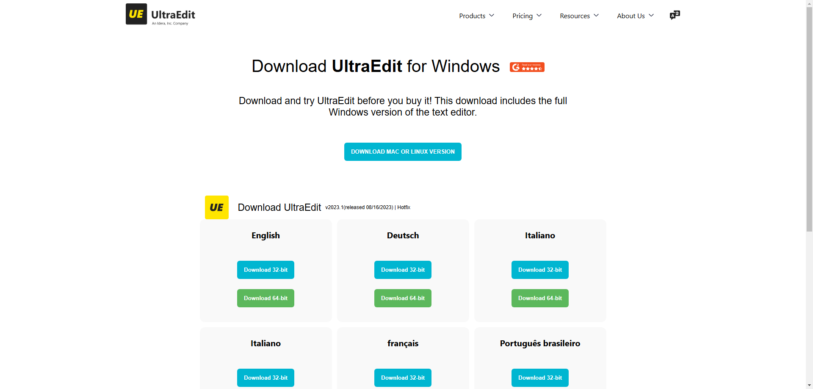
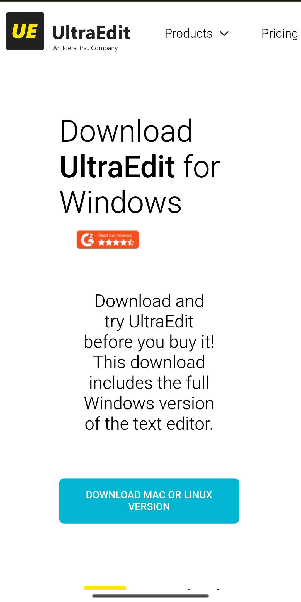

# Clone of UltraEdit Website Download Page

This repository contains a **responsive clone** of the UltraEdit website's download page, built entirely with **pure HTML and CSS**. The project replicates the design and layout of the original page, ensuring a similar look and feel while being fully responsive for seamless performance across different devices.

---

#Try It Out Yourself!
https://ultraedit-downloadpage-clone.netlify.app/

## 🌟 Features

- **Responsive Design:** The page adjusts perfectly across desktop, tablet, and mobile devices.
- **Pixel-perfect Clone:** A close replica of the UltraEdit download page.
- **Pure HTML & CSS:** No JavaScript or external frameworks used.
- **Clean and Modular Code:** Well-organized for easy understanding and modification.

---

## 🖼️ Screenshots

<Add screenshots or GIFs showing the cloned webpage on different devices.>


### Desktop & Mobile


### Pc View


### Mobile View


---

## 🙏 Acknowledgments

- Original design inspiration: [UltraEdit Download Page](https://www.ultraedit.com/downloads/ultraedit-download-thank-you)  

## 🛠️ Installation & Usage

1. Clone this repository to your local machine:
   ```bash
   git clone https://github.com/ZularnainX/UltraEdit-Website-Clone.git
